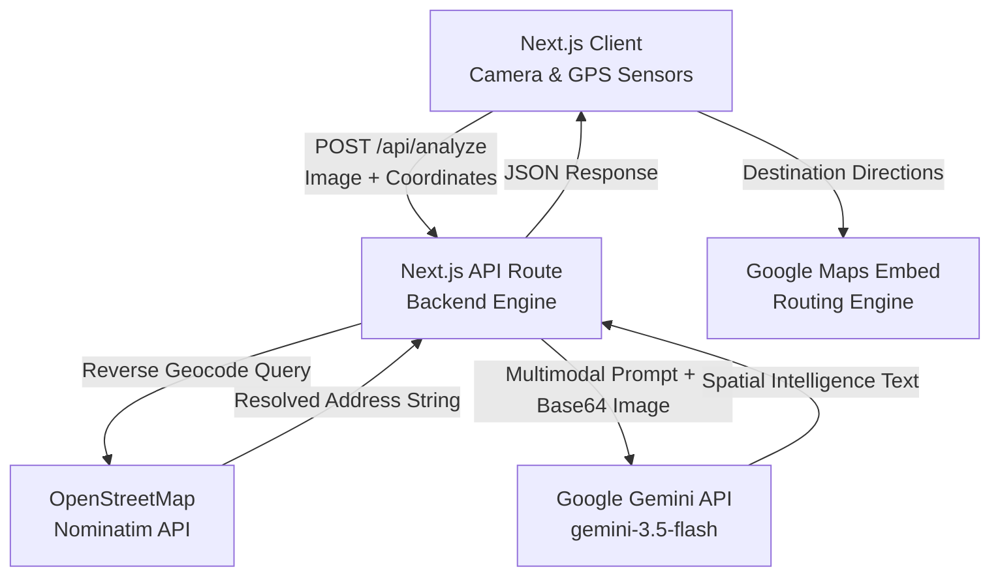

# WayFinder

WayFinder is an AI-powered spatial intelligence and location assistance web application. It combines real-time camera capture, GPS positioning, reverse geocoding, and multimodal AI analysis to identify immediate physical surroundings, confirm real-world addresses, discover nearby points of interest, and provide interactive navigation routing.

[](https://nextjs.org/)
[](https://react.dev/)
[](https://www.typescriptlang.org/)
[](https://tailwindcss.com/)
[](https://ai.google.dev/)
[](https://nominatim.openstreetmap.org/)

---

## Features

- **Live Camera Capture & Frame Extraction**: Captures live photos directly from the device's camera stream (`navigator.mediaDevices.getUserMedia`, preferring the environment/rear-facing lens) and extracts active frames via an HTML5 canvas to a JPEG payload.
- **GPS Telemetry & Reverse Geocoding**: Automatically locks coordinates using the browser Geolocation API (with manual coordinate override capabilities) and reverse-geocodes them into a verified physical street address via the OpenStreetMap Nominatim API.
- **Multimodal AI Spatial Analysis**: Sends the captured frame alongside the resolved street address to Google Gemini (`gemini-3.5-flash`), which generates:
  - A description of the immediate environment and detected objects.
  - The user's accurate real-world street address.
  - Two nearby points of interest / tourist destinations.
- **Embedded Google Maps & Routing Engine**: Pins the user's location on an interactive embedded Google Map, offering turn-by-turn routing between customizable origin and destination points across multiple travel modes (driving, walking, bicycling, transit).
- **Session Telemetry & Data Logs**: Persists scan history to browser `localStorage`, providing a telemetry dashboard with formatted Markdown intelligence reports and one-click CSV database export.

---

## Architecture

WayFinder operates through an integrated Next.js client-server architecture:

- **Client Tier (Next.js / React)**: Interfaces with device hardware (camera and GPS), buffers image captures on HTML5 canvas, manages application state, and renders the command center UI.
- **Backend Tier (Next.js API Route)**: Receives the multipart form payload at `/api/analyze`, performs reverse geocoding via Nominatim OpenStreetMap, constructs a structured multimodal prompt, and invokes the Gemini API.
- **AI & Mapping Services**: Google Gemini generates spatial descriptions and points of interest, while Google Maps embeds handle spatial display and live routing.



---

## Tech Stack

- **Frontend**: Next.js (App Router), React 19, TypeScript, Tailwind CSS, Lucide React, `next-themes`, `react-markdown`
- **Backend**: Next.js API Routes (`/api/analyze`)
- **AI Engine**: Google Gemini API (`@google/generative-ai` / `gemini-3.5-flash`)
- **Geocoding Service**: OpenStreetMap Nominatim API
- **Mapping & Routing**: Google Maps Embed
- **Client Storage**: Browser `localStorage` (telemetry caching and CSV export)

---

## Required Environment Variables

To run WayFinder, configure the following environment variable in your root `.env.local` file:

| Variable Name | Required | Description | Example / Notes |
| :--- | :--- | :--- | :--- |
| `GEMINI_API_KEY` | **Yes** | API key for Google Gemini generative AI models | Obtain from [Google AI Studio](https://aistudio.google.com/) |

---

## Getting Started

### Prerequisites

- **Node.js**: `v18.0.0` or higher
- **npm** / **yarn** / **pnpm** / **bun**
- A **Google Gemini API Key**

### 1. Clone the Repository

```bash
git clone https://github.com/athishio/wayfinder.git
cd wayfinder
```

### 2. Install Dependencies

```bash
npm install
```

### 3. Configure Environment Variables

Create a `.env.local` file in the root directory:

```bash
# .env.local
GEMINI_API_KEY=your_gemini_api_key_here
```

### 4. Run the Development Server

```bash
npm run dev
```

Open [http://localhost:3000](http://localhost:3000) with your browser. When prompted, allow camera and location permissions for full spatial functionality.

---

## API Reference

### `POST /api/analyze`

Processes an uploaded image alongside GPS coordinates to produce a Gemini-powered spatial intelligence report.

#### Request Body (`multipart/form-data`)

| Field | Type | Required | Description |
| :--- | :--- | :--- | :--- |
| `campus_image` | `File` | **Yes** | JPEG / PNG image captured from camera or uploaded |
| `latitude` | `string` | No | Latitude coordinate (e.g. `"10.8988"`) |
| `longitude` | `string` | No | Longitude coordinate (e.g. `"76.9015"`) |

#### Response (`application/json`)

```json
{
  "success": true,
  "ai_text": "You are currently standing in front of... The user's accurate address is ... Nearby attractions include ... If you want to navigate anywhere, access the Live Map below."
}
```

---

## Project Structure

```text
wayfinder/
├── app/
│   ├── api/
│   │   └── analyze/
│   │       └── route.ts          # Backend route for Geocoding & Gemini AI
│   ├── dashboard.tsx             # Main dashboard (Camera, GPS, Maps & Routing)
│   ├── datalogs.tsx              # Historical scan telemetry & CSV export
│   ├── globals.css               # Global Tailwind CSS styles
│   ├── layout.tsx                # App root layout with ThemeProvider
│   ├── page.tsx                  # Primary page shell and sidebar navigation
│   ├── settings.tsx              # Application preferences and appearance
│   └── ThemeProvider.tsx         # Dark / Light theme context wrapper
├── public/                       # Static public assets
├── .env.local                    # Local environment variables (ignored by git)
├── next.config.ts                # Next.js configuration
├── package.json                  # Dependencies and project scripts
├── tailwind.config.js            # Tailwind CSS configuration
└── tsconfig.json                 # TypeScript compiler configuration
```

---

## Scripts

| Command | Description |
| :--- | :--- |
| `npm run dev` | Starts the Next.js development server on `http://localhost:3000` |
| `npm run build` | Compiles and builds the production application |
| `npm run start` | Boots the compiled Next.js production server |
| `npm run lint` | Executes ESLint to check for code quality and syntax issues |
