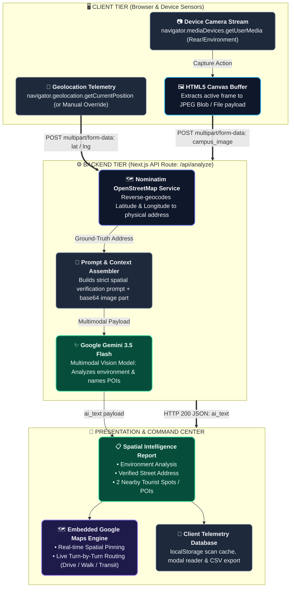

# WayFinder

WayFinder is an AI-powered spatial intelligence and location assistance web application. It combines camera capture, GPS positioning, reverse geocoding, and multimodal AI analysis to identify surroundings, verify physical location, discover points of interest, and provide interactive navigation routing.

---

## Features

- **Live Camera Capture**: Uses `navigator.mediaDevices.getUserMedia` (requesting environment/rear-facing camera by default) and an HTML5 canvas to capture images directly from the device.
- **GPS Telemetry & Reverse Geocoding**: Reads device GPS coordinates via the Geolocation API (with support for manual coordinate overrides) and resolves them into a physical street address using the OpenStreetMap Nominatim API.
- **Multimodal AI Analysis**: Analyzes captured imagery alongside geocoded location data using Google's Gemini API (`gemini-3.5-flash`).
  - Describes the immediate physical environment and visible objects.
  - Confirms the user's resolved physical address.
  - Suggests 2 nearby points of interest / tourist spots.
- **Embedded Google Maps & Routing**: Displays the current location on an interactive embedded Google Map, with directions and routing capabilities between origin and destination for multiple travel modes (driving, walking, bicycling, transit).
- **Session Telemetry Logs**: Caches recent scan reports in browser `localStorage` with options to view detailed intelligence markdown reports or export logs to CSV.

---

## How It Works



1. **Capture**: The user launches the live camera feed (or uploads an image). A frame is captured to a canvas and converted to an image payload.
2. **Geolocate & Geocode**: The client retrieves GPS coordinates. When sent to the backend (`/api/analyze`), coordinates are reverse-geocoded into a human-readable street address using the OpenStreetMap Nominatim service (`https://nominatim.openstreetmap.org/reverse`).
3. **Analyze**: The backend sends the image and resolved address to Google Gemini (`gemini-3.5-flash`), which generates an environment description, confirms the location, and highlights nearby spots.
4. **Navigate**: The AI report is rendered in markdown alongside an embedded Google Maps view allowing the user to plan routes to destinations.

---

## Tech Stack

- **Framework**: [Next.js](https://nextjs.org/) (App Router)
- **UI & Styling**: React 19, [Tailwind CSS](https://tailwindcss.com/), [Lucide React](https://lucide.dev/), `next-themes`
- **AI & Multimodal**: [`@google/generative-ai`](https://www.npmjs.com/package/@google/generative-ai) (`gemini-3.5-flash`)
- **Geocoding**: OpenStreetMap Nominatim API
- **Maps**: Google Maps Embed

---

## Getting Started

### Prerequisites

- [Node.js](https://nodejs.org/) (version 18+ recommended)
- A Google Gemini API Key (obtainable from [Google AI Studio](https://aistudio.google.com/))

### Installation

1. **Clone the repository:**
   ```bash
   git clone https://github.com/athishio/wayfinder.git
   cd wayfinder
   ```

2. **Install dependencies:**
   ```bash
   npm install
   ```

3. **Configure Environment Variables:**
   Create a `.env.local` file in the root directory:
   ```env
   GEMINI_API_KEY=your_gemini_api_key_here
   ```

4. **Run the development server:**
   ```bash
   npm run dev
   ```

5. **Open the application:**
   Navigate to [http://localhost:3000](http://localhost:3000) in your web browser. Ensure camera and location permissions are granted when prompted.

---

## Scripts

- `npm run dev` - Starts the development server.
- `npm run build` - Builds the application for production.
- `npm run start` - Starts the production server.
- `npm run lint` - Runs ESLint code quality checks.
